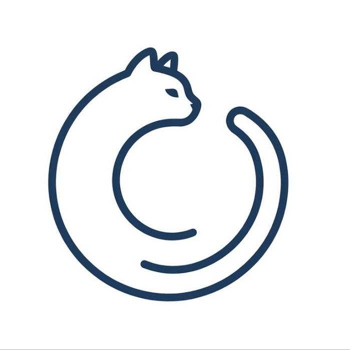

<div align="center">
  
  <h1>Kairos-Runtime</h1>
  <p>An agent runtime that treats context, execution, and permissions as OS primitives — not LLM problems.</p>

  <p>📌 <a href="./docs/brand/001-logo.md">Logo Design Philosophy</a></p>

  <div align="center">
    
    
    
    
    
    
  </div>
  <hr>
</div>


> Like light — particle and wave, yet neither classical.  
> OS primitives. Agent-centered. Neither, in the classical sense.

## A short story

My friend's framework was querying 100k tokens per request. Every message. Every time. I thought there had to be a better way.

There was. But solving it properly meant building something that doesn't exist yet.

---

## The core idea

Most agent frameworks are flat. Context, tools, memory, and permissions all pile into the same prompt, coordinated by the LLM itself. This has never been best practice in computer science.

Processes don't manage their own memory. Applications don't manage their own permissions. **Agents shouldn't manage their own context.**

That's what this runtime does instead.

**Stateless agent. Stateful runtime.**

The agent is just a function — triggered, executed, destroyed. The runtime owns everything else: context assembly, state persistence, execution isolation, and permission enforcement.

---

## Architecture

### Memory Layer — Context as a first-class citizen

Instead of dumping all messages into a context window, conversations are clustered into semantically coherent sessions using embedding-based center vectors.

The key insight: **social topology beats semantic topology** in group chat. When someone replies to a message, that reply belongs to the same session — regardless of semantic similarity. Human conversational context is more reliable than word vectors.

Sessions are organized in three layers:

| Layer | State | Location |
|-------|-------|----------|
| L0 | Active | In-memory |
| L1 | Inactive | In-memory |
| L2 | Archived | Persistent store (OpenViking alike VFS) |

A session activates when one of its messages receives a reply. Layers promote and demote via LRU. When no in-memory session matches an incoming message, the runtime fetches from L2 — a page fault, in OS terms.

> ⚠️ L0/L1 memory layer and L2 archival and retreival is implemented. 

### Execution Layer — Sandboxed, recoverable, self-evolving

Agents run inside `containerd`. Before any dangerous operation, the runtime checkpoints state via CRIU. If the agent crashes or corrupts the environment, it rolls back automatically.

Checkpoint and restore are exposed as ordinary tools — the agent decides when to call them. This means the agent can operate at the edge of what's safe, knowing it can always return to a known-good state.

The `evolute` tool lets agents write and invoke their own tools within the same ReAct loop — dynamic capability expansion, sandboxed and recoverable.

> ⚠️ Execution layer (CRIU checkpoint/rollback, evolute) is experimental.

### Security Layer — Permissions enforced at the system level

Tool access is determined by user group, not by prompt instructions.

- `admin` → full tool set injected (read/write, bash, evolute, etc.)
- `non-admin` → read-only tools injected (fetch, read_file, etc.)

**The LLM never sees tools it isn't allowed to use.** Jailbreaks fail not because the model is better-instructed, but because the attack surface doesn't exist. Permissions are enforced via Node.js V8 API injection inside containerd, scoped to spawn, subprocess, and filesystem access.

---

## Status

This project is in early development. The memory layer (L0/L1) is the most complete part. Everything else is being actively built.

| Component | Status |
|-----------|--------|
| L0/L1 session clustering | ✅ Implemented |
| L2 archival (OpenViking alike VFS) | ✅ Implemented |
| L2 retrieval (OpenViking alike VFS) | ✅ Implemented |
| containerd sandbox | 🚧 In progress |
| CRIU checkpoint/rollback | ⚠️ Experimental(In progress) |
| evolute (self-writing tools) | ⚠️ Experimental(Implemented) |
| Permission enforcement | 🚧 In progress |

---

## Design philosophy

For the full story of why this was built this way — the wrong turns, the realizations, and the reasoning behind every architectural decision — read the design document: [link]

---

## Getting started

```bash
bun install
bun run dev
```

Then you should install ollama and run it. It's required to run the embedding service.

```bash
curl -fsSL https://ollama.com/install.sh | sh
ollama serve
```

### Run with Docker

If your host user cannot access `containerd.sock`, run the project in Docker as root and mount the host socket:

Set required secrets before starting:

```bash
export BOT_TOKEN="your_telegram_bot_token"
export API_KEY="your_llm_api_key"
```

Build `memory-vfs` artifact on host (faster than compiling in Docker):

```bash
bash scripts/build-vfs.sh --release
# or:
bash scripts/build-vfs.sh --debug
```

`build-vfs.sh` defaults to Docker backend (`rust:bookworm`) to avoid glibc mismatch
between host-built binaries and Debian runtime container. Use `--native` only when
your host libc is compatible with container runtime.

```bash
docker compose up --build app
```

### Common UDS troubleshooting (`state-daemon` -> `enclave-runtime`):

- Symptom: socket file exists but client still fails (`ENOENT`, `EACCES`, or `UNAVAILABLE`).
- Check target consistency first:
  - `state-daemon` target (`AGENT_ENCLAVE_TARGET`)
  - sandbox listen addr (`ENCLAVE_LISTEN`)
- Verify socket visibility and permissions on host:

```bash
ls -l /run/kairos-runtime/sockets/kairos-runtime-enclave.sock
lsof -U /run/kairos-runtime/sockets/kairos-runtime-enclave.sock
```

- In containerd sandbox mode, prefer a dedicated socket directory such as `/run/kairos-runtime/sockets` instead of exposing `/tmp`.
- Enclave may create the UDS as `root`; host non-root clients can fail to connect if permissions are too strict.
- Current runtime sets socket mode to `666` after bind to avoid host/client user mismatch.

### Run sandboxd on host (without Docker)

```bash
bash scripts/run-sandbox-host.sh --dry-run
# or:
bash scripts/run-sandbox-host.sh --release

# at another terminal, run:
OLLAMA_BASE_URL="http://127.0.0.1:11434" bun run src/state-daemon/dev
# at another terminal, run:
cargo run --manifest-path src/vfs/Cargo.toml
```

Run `sandboxd` in Docker as well:

```bash
docker compose --profile sandbox up --build sandboxd
```

Notes:

- This setup mounts `/run/containerd/containerd.sock` from host into container.
- `sandboxd` still talks to host containerd (not dind), which keeps CRIU/containerd flow aligned with later plans.

---

## License

LICENSE: AGPLv3

Copyright (C) 2026 kairos-runtime. All rights reserved.